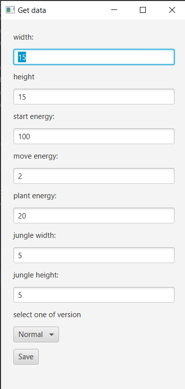

# EvoultionSimulator
Project implemented during AGH Object-Oriented Programming course and implements most of
[requirements](https://github.com/apohllo/obiektowe-lab/tree/master/proj1). The project presents simulations of the [animal world](#animal-world).
They can move, eat, reproduce and die. While they are moving, their energy diminishes, but they can regain it by eating plants. In the center of map there is a jungle, so if the animal is there, 
his chances of survival  increase. When their energy level is equal zero, they die. The breeding of animals takes place when two of them stand on one field. 
The application allows to see what 
is happening on the two panels: 
* [left panel](#left-panel)
* [right panel](#right-panel)

## Animal World
#### Map legend

  

Before you start the simulation you can choose parameters or use default data.
  

This simulation has got two version. First of them is normal, so the animals just die. Second of them is magic! When in our world stay only five or less animals, 
then five more creation appear :)  The map informs us about this moment on the left panel, like on this film.

