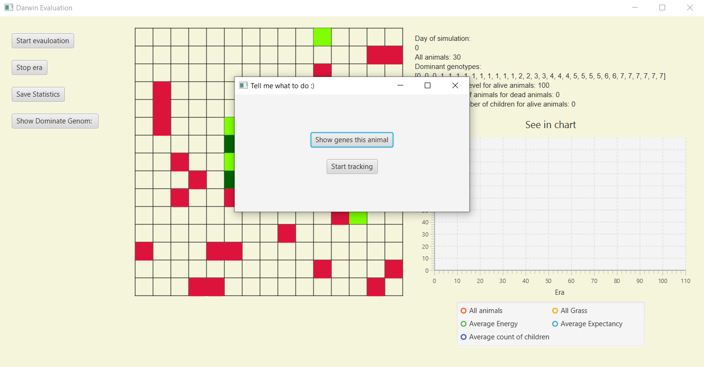

# EvoultionSimulator
Project implemented during AGH Object-Oriented Programming course and implements most of
[requirements](https://github.com/apohllo/obiektowe-lab/tree/master/proj1). The project presents simulations of the [animal world](#animal-world).
They can move, eat, reproduce and die. While they are moving, their energy diminishes, but they can regain it by eating plants. In the center of map there is a jungle, so if the animal is there, 
his chances of survival  increase. When their energy level is equal zero, they die. The breeding of animals takes place when two of them stand on one field. 
The application allows to see what 
is happening on the two panels: 
* [left panel](#left-panel)
* [right panel](#right-panel)

## Animal World
#### ->Map legend

  

  

#### ->Simulation 

Before you start the simulation you can choose parameters or use default data.
  

  

 
This simulation has got two version. First one is normal, so the animals just die. Second one is magic! When in our world stay only five or less animals, 
then five more creation appear :)  The map informs us about this moment on the left panel, like on this film.
  

  

#### ->Left Panel
If you stop animation, you can: 
* [save statistic additionaly](#save-statistic-additionaly)
* [see all animals which have dominant genom](#see-all-animals-which-have-dominant-genom)
* [click on animal to  strat tricking or see it genom](#click-on-animal-to-strat-tricking-or-see-it-genom)

##### Save statistic additionaly 
If you click on button "Save statistic", you can save the same statistic which you can see on right panel on whatever you want file (but it should exist!). In our simulation statitics are automatically saved in default file, so it is additional action.

  
    

##### See all animals which have dominant genom
If you click button "Show Dominant Genom", you can see "!" on at least one field. This mark means that animal on this position has genom which is the most popular in population.

   

##### Click on animal to strat tricking or see it genom
If the simulation is not running,  you can click on any animal you want. Then you can see scene like this:

  

You have two opiotons. First of them will just show the genome of the pet. But second option is amazing! You can trick animal on left panel and see interesting info about this animal.
   

   
#### ->Right Panel
As you can see above, on right panel you can see temp statistic on every day(Era).
   
#### Developed by @mpyrek
